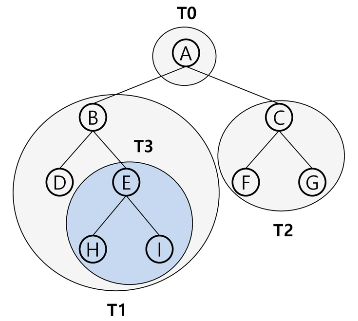

# 1. 선형 자료구조
일렬로 나타낼 수 있는 1:1 구조의 자료 형태

ex) 배열 . . .

### 1.1. Stack

>먼저 입력된 자료가 나중에 출력되는 FILO(=LIFO) 방식의 자료 구조  
>>- stack 기본 메서드 : push, pop, peek, [isEmpty, size 등...]

```java
// 자료구조 stack을 직접 구현해보자.
public class Stack {
	// final 상수는 한번 값을 정하면 변경할 수 없으며, 객체 생성 시에 초기화 해주어야 한다.
	private final int MAX_STACK_SIZE;
	private String[] stack;
	private int top = -1;

	public Stack() {
		this(5);
	}

	public Stack(int maxSize) {
		MAX_STACK_SIZE = maxSize;
		stack = new String[MAX_STACK_SIZE];
	}

	// stack 기본 구조 : push, pop, peek, [isEmpty, size 등...]
	// push
	public void push(String element) {
		if (top >= MAX_STACK_SIZE - 1) {
			System.out.println("Stack Overflow");
			return;
		}
		stack[++top] = element;
	}

	// pop
	public String pop() {
		String e = peek();
		if (e != null)
			stack[top--] = null;
		return e;
	}

	// 예외처리 pop
	public String pop2() {
		String e = peek2();
		if (e != null)
			stack[top--] = null;
		return e;
	}

	// peek
	public String peek() {
		if (isEmpty()) {
			System.out.println("Stack Underflow");
			return null;
		}
		return stack[top];
	}

	// 예외처리 peek
	public String peek2() {
		if (isEmpty()) {
			throw new RuntimeException("Stack Underflow");
		}
		return stack[top];
	}

	// empty
	public boolean isEmpty() {
		return top < 0 ? true : false;
	}

	// size
	public int size() {
		return top + 1;
	}
}
```

### 1.2. Queue

>먼저 입력된 자료가 먼저 출력되는 FIFO(=LILO) 방식의 자료 구조  
>>- 종류 : 선형큐, 원형큐, 연결큐  
>>- Queue 기본 메서드 : enqueue, dequeue, front, rear, [isEmpty, size 등...]  

```java
// 자료구조 Queue를 직접 구현해보자.
// 1. 선형 큐
public class Queue {
	private Object[] queue;
	private final int MAX_QUEUE_SIZE;
	private int front, rear;

	public Queue(int maxSize) {
		MAX_QUEUE_SIZE = maxSize;
		queue = new Object[MAX_QUEUE_SIZE];
		front = rear = -1;
	}

	public boolean isEmpty() {
		return front == rear;
	}

	public boolean isFull() {
		return rear == MAX_QUEUE_SIZE - 1;
	}

	public void enQueue(Object item) {
		if (isFull())
			throw new RuntimeException("Queue Overflow");
		queue[++rear] = item;
	}

	public Object front() {
		if (isEmpty())
			throw new RuntimeException("Queue Underflow");
		return queue[front + 1];
	}

	public Object rear() {
		if (isEmpty())
			throw new RuntimeException("Queue Underflow");
		return queue[rear];
	}

	public Object deQueue() {
		Object result = front();
		queue[++front] = null;
		return result;
	}

	public int size() {
		return rear - front;
	}
}
```

**※ 선형 큐의 문제점**  
- 잘못된 포화상태 인식 : rear값이 배열의 끝에 다다르면 앞에 deQueue로 인해 비어있는 공간을 체크하지 못한 채 큐가 꽉 차있다고 판단하게 됨.  
- 이러한 문제를 해결하기 위해 배열의 끝에 다다르면 배열의 첫번째로 다시 enQueue하는 형식의 **원형큐**를 사용한다.

```java
// 2. 원형 큐
public class CircularQueue {
	private Object[] queue;
	private final int MAX_QUEUE_SIZE;
	private int front, rear;

	public CircularQueue(int maxSize) {
		MAX_QUEUE_SIZE = maxSize;
		queue = new Object[MAX_QUEUE_SIZE];
		front = rear = 0; // 선형큐와 차이가 보이는 부분 체크
	}

	public boolean isEmpty() {
		return front == rear;
	}

	public boolean isFull() {
		return ((rear + 1) % MAX_QUEUE_SIZE) == front; // 체크
	}

	public void enQueue(Object item) {
		if (isFull())
			throw new RuntimeException("Queue Overflow");
		rear = (rear + 1) % MAX_QUEUE_SIZE; // 체크
		queue[rear] = item;// 체크
	}

	public Object front() {
		if (isEmpty())
			throw new RuntimeException("Queue Underflow");
		return queue[(front + 1) % MAX_QUEUE_SIZE]; // 체크
	}

	public Object rear() {
		if (isEmpty())
			throw new RuntimeException("Queue Underflow");
		return queue[rear];
	}

	public Object deQueue() {
		Object result = front();
		front = (front + 1) % MAX_QUEUE_SIZE; // 체크
		queue[front] = null; // 체크
		return result;
	}
}
```

### 1.3. List

>순서를 가진 데이터의 집합을 가리키는 추상자료형(abstract data type)  
>>- 종류  
>>순차리스트 : 배열을 기반으로 구현  
>>연결리스트 : 메모리의 동적 할당을 기반으로 구현  


#### 1.3.1. 단순 연결리스트(SimpleLinkedList)

>연결 리스트에서 하나의 원소에 필요한 데이터를 갖고 있는 자료 단위  
>>- 구성  
>>데이터 필드 : 원소의 값을 저장  
>>링크 필드 : 다음 노드의 주소를 저장  

```java
// 단순 연결리스트(SimpleLinkedList) 구현
public class SimpleLinkedList {
	// inner 클래스
	private static class Node {
		Object data;
		Node link;

		public Node() {
		}

		public Node(Object data) {
			this.data = data;
		}

		public Node(Object data, Node link) {
			this.data = data;
			this.link = link;
		}
	}

	private Node head; // 첫번째 노드를 가리키는 포인터 역할
	private int size;

	public void addFirstNode(Object data) {
		Node newNode = new Node(data, head); // data와 link로 head를 가진 새 노드 생성
		head = newNode; // head에 생성한 노드를 덮어씀
		size++;
	}

	public Node getLastNode() {
		Node current = head;
		if (current != null) {
			while (current.link != null) {
				current = current.link;
			}
		}
		return current;
	}

	public void addLastNode(Object data) {
		Node lastNode = getLastNode(); // 마지막 노드를 찾고
		Node newNode = new Node(data); // 새 노드를 생성하여
		if (lastNode != null) {
			lastNode.link = newNode; // 마지막 노드 뒤에 생성한 노드를 연결
		} else { // 리스트가 공백이었을 경우엔 lastNode에 null이 들어옴
			head = newNode;
		}
		size++;
	}

	public void deleteFirstNode() {
		if (head == null) // 노드가 비어있는지를 확인하고
			throw new RuntimeException("리스트가 이미 비어있습니다.");
		Node temp = head; // 첫번째 노드를 temp에 저장해두고
		head = head.link; // 첫번째 노드가 가지고 있는 link 노드를 head에 연결
		temp.link = null; // temp에 저장한 첫번째 link 노드를 지움
		size--;
	}

	public Node getPreviousNode(Node node) {
		if (size < 2)
			return null;
		Node current = head;
		if (current != null) {
			while (current.link != node) {
				current = current.link;
			}
		}
		return current;
	}

	public int getSize() {
		return size;
	}

	public void deleteLastNode() {
		if (head == null) // 노드가 비어있는지를 확인
			throw new RuntimeException("리스트가 이미 비어있습니다.");
		Node lastNode = getLastNode(); // 마지막 노드를 찾고
		Node previousNode = getPreviousNode(lastNode); // 마지막의 바로 이전 노드를 찾아
		if (previousNode != null) {
			previousNode.link = null; // 이전 노드에 연결된 link노드를 지움
		} else {
			head = null;
		}
		size--;
	}

	public void print() {
		Node current = head;
		while (current != null) {
			System.out.print(current.data + " ");
			current = current.link;
		}
		System.out.println();
	}
}
```

#### 1.3.2. 이중 연결리스트(DoublyLinkedList)

>양쪽 방향으로 순회할 수 있도록 노드를 연결한 리스트  
>>- 구성  
>>데이터필드 : 원소의 값을 저장  
>>링크 필드 : 두개의 링크 필드로 head와 tail 2군데를 연결  

```java
// 이중 연결리스트(DoublyLinkedList) 구현
public class DoublyLinkedList {
	// inner 클래스
	private static class Node {
		Object data;
		Node pre, next;

		public Node() {
		}

		public Node(Object data) {
			this.data = data;
		}

		public Node(Object data, Node pre, Node next) {
			this.data = data;
			this.pre = pre;
			this.next = next;
		}
	}

	private Node head;
	private int size;

	public void addFirstNode(Object data) {
		Node newNode = new Node(data, null, head);
		if (head != null) {
			head.pre = newNode;
		}
		head = newNode;
		size++;
	}

	public Node getLastNode() {
		Node current = head;
		if (current != null) {
			while (current.next != null) {
				current = current.next;
			}
		}
		return current;
	}

	public void addLastNode(Object data) {
		Node lastNode = getLastNode();
		Node newNode = new Node(data);
		if (lastNode != null) {
			head = newNode;
		} else {
			lastNode.next = newNode;
			newNode.pre = lastNode;
		}
		size++;
	}

	public void deleteFirstNode() {
		if (head == null)
			throw new RuntimeException("리스트가 이미 비어있습니다.");
		Node temp = head;
		head = head.next;
		if (head != null)
			head.pre = null;
		temp.next = null;
		size--;
	}

	public int getSize() {
		return size;
	}

	public void deleteLastNode() {
		if (head == null)
			throw new RuntimeException("리스트가 이미 비어있습니다.");
		Node lastNode = getLastNode();
		Node preNode = lastNode.pre;
		if (preNode != null) {
			preNode.next = null;
		} else {
			head = null;
		}
		lastNode.pre = null;
		size--;
	}

	public void print() {
		Node current = head;
		while (current != null) {
			System.out.print(current.data + " ");
			current = current.next;
		}
		System.out.println();
	}
}
```

# 2. 비선형 자료구조
1:N, N:N 구조의 자료 형태

ex) 트리, 그래프 . . .

### 2.1. Tree

>원소들 간에 1:N 관계, 계층 관계를 가지는 자료구조  
>상위 원소에서 하위 원소로 내려가면서 확장
>>- 용어  
>>노드(node) : 트리의 원소  
>>간선(edge) : 노드를 연결하는 선, 부모 노드와 자식 노드를 연결  
>>루느 노드(root node) : 트리의 시작 노드  
>>형제 노드(sibling node) : 같은 부모 노드의 자식 노드들  
>>단말 노드(=리프 노드) : 자식 노드가 없는 노드(차수가 0인 노드)  
>>서브 트리(sub tree) : 부모 노드와 연결된 간선을 끊었을 때 생성되는 트리  
>>차수(degree) : 노드에 연결된 자식 노드의 수  
>>높이 : 루트에서 노드에 이르는 간선 수  
>>- 트리의 순회  
>>전위 순회(preorder traversal) : 부모노드 방문 후 자식노드를 좌->우 순으로 방문  
>>중위 순회(inorder traversal) : 왼쪽 자식노드, 부모, 오른쪽 자식노드 순으로 방문  
>>후위 순회(postorder traversal) : 자식노드를 좌->우 순으로 방문 후 부모노드를 방문  
>>  
>>전위 : A B D E H I C F G  
>>중위 : D B H E I A F C G  
>>후위 : D H I E B F G C A  

#### 2.1.1. 이진트리(Binary Tree)

>모든 노드들이 2개 이하의 자식을 가지는 트리

#### 2.1.2. 포화 이진트리(Full Binary Tree)

>리프노드를 제외한 모든 노드들이 2개의 자식을 가지는 이진 트리

#### 2.1.3. 완전 이진트리(Complete Binary Tree)

>루트 노드부터 마지막 n번째 노드까지 빈 자리가 없는 이진 트리

#### 2.1.4. 편향 이진트리(Skewed Binary Tree)

>한쪽 방향의 자식 노드만 계속해서 가지는 이진 트리

```java
// 자료구조 Tree를 직접 구현해보자.
// 1. 1차원 배열을 이용한 완전 이진 트리(Binary Tree) 구현
public class BinaryTree {
	private Object[] nodes;
	private int idx = 0;
	private final int SIZE;
	private final int LEVEL; // 트리 높이

	public BinaryTree(int size) {
		SIZE = size;
		nodes = new Object[SIZE + 1];
		LEVEL = (int) Math.ceil(Math.log(SIZE + 1) / Math.log(2)) - 1;
	}

	public boolean isEmpty() {
		return idx == 0;
	}

	public boolean isFull() {
		return idx == SIZE;
	}

	public void add(Object o) {
		if (isFull())	throw new RuntimeException("Tree Overflow!");
		nodes[++idx] = o;
	}

	// 전위 순회
	public void printPreorder() {
		printPreorder(1);
		System.out.println();
	}

	private void printPreorder(int current) {
		if (current <= idx) {
			System.out.print(nodes[current] + " "); // 현재노드
			printPreorder(current * 2); // 왼쪽노드
			printPreorder(current * 2 + 1); // 왼쪽노드
		}
	}

	// 중위 순회
	public void printInorder() {
		printInorder(1);
		System.out.println();
	}

	private void printInorder(int current) {
		if (current <= idx) {
			printInorder(current * 2); // 왼쪽노드
			System.out.print(nodes[current] + " "); // 현재노드
			printInorder(current * 2 + 1); // 왼쪽노드
		}
	}

	// 후위 순회
	public void printPostorder() {
		printPostorder(1);
		System.out.println();
	}

	private void printPostorder(int current) {
		if (current <= idx) {
			printPostorder(current * 2); // 왼쪽노드
			printPostorder(current * 2 + 1); // 왼쪽노드
			System.out.print(nodes[current] + " "); // 현재노드
		}
	}

	// 레벨 별 출력
	public void printLevelorder() {
		printLevelorder(1);
	}

	private void printLevelorder(int level) {
		for (int i = (int) Math.pow(2, level - 1); i < (int) Math.pow(2, level); ++i) {
			if (i > SIZE)	return;
			System.out.print(nodes[i] + " ");
		}
		System.out.println();
		printLevelorder(level + 1);
	}

	public static void main(String[] args) {
		int size = 10;
		BinaryTree tree = new BinaryTree(10);

		for (int i = 0; i < size; i++) {
			tree.add((char) ('A' + i));
		}

		tree.printPreorder();
		tree.printInorder();
		tree.printPostorder();
		tree.printLevelorder();
	}
}
```

```java
// 2. 연결리스트(Linked List)를 이용한 이진 트리(Binary Tree) 구현
// 연결 리트트 표현을 위한 TreeNode 클래스
public class TreeNode {
	public Object data;
	TreeNode left, right;

	public TreeNode(Object data) {
		this.data = data;
	}

	private TreeNode(Object data, TreeNode left, TreeNode right) {
		this.data = data;
		this.left = left;
		this.right = right;
	}
}

// 연결 리스트를 이용한 이진 트리 LinkedBinaryTree 클래스
import java.util.Scanner;

public class LinkedBinaryTree {
	private TreeNode root;
	private int size;

	public void add(Object pData, Object data) {
		TreeNode pNode = getNode(root, pData);
		if (pNode == null && size == 0) { // tree가 공백일 때
			root = pNode = new TreeNode(pData);
			size++;
		} else if (pNode == null) { // 찾는 부모 노드가 존재하지 않을 때
			throw new RuntimeException("부모 노드가 존재하지 않습니다.");
		}

		TreeNode newNode = new TreeNode(data);
		if (pNode.left == null) {
			pNode.left = newNode;
			size++;
		} else if (pNode.right == null) {
			pNode.right = newNode;
			size++;
		} else {
			throw new RuntimeException("자식 노드가 모두 존재합니다.");
		}
	}

	private TreeNode getNode(TreeNode current, Object data) {
		if (current == null)
			return null;
		if (current.data.equals(data))
			return current;

		TreeNode temp = getNode(current.left, data);
		if (temp == null)
			temp = getNode(current.right, data);

		return temp;
	}

	public void printPreorder() {
		printPreorder(root);
		System.out.println();
	}

	private void printPreorder(TreeNode current) {
		if (current != null) {
			System.out.print(current.data + " ");
			printPreorder(current.left);
			printPreorder(current.right);
		}
	}

	public void printInorder() {
		printInorder(root);
		System.out.println();
	}

	private void printInorder(TreeNode current) {
		if (current != null) {
			printInorder(current.left);
			System.out.print(current.data + " ");
			printInorder(current.right);
		}
	}

	public void printPostorder() {
		printPostorder(root);
		System.out.println();
	}

	private void printPostorder(TreeNode current) {
		if (current != null) {
			printPostorder(current.left);
			printPostorder(current.right);
			System.out.print(current.data + " ");
		}
	}

	public static void main(String[] args) {
//		 13
//		 1 2 1 3 2 4 3 5 3 6 4 7 5 8 5 9 6 10 6 11 7 12 11 13
		Scanner sc = new Scanner(System.in);
		LinkedBinaryTree tree = new LinkedBinaryTree();
		int n = sc.nextInt();
		int edgeCnt = n - 1;
		while (edgeCnt-- > 0) {
			tree.add(sc.nextInt(), sc.nextInt());
		}

		tree.printPreorder();
		tree.printInorder();
		tree.printPostorder();
	}
}
```

### 2.2. Graph

>.
>- Graph

```java
// 자료구조 Graph을 직접 구현해보자.

```