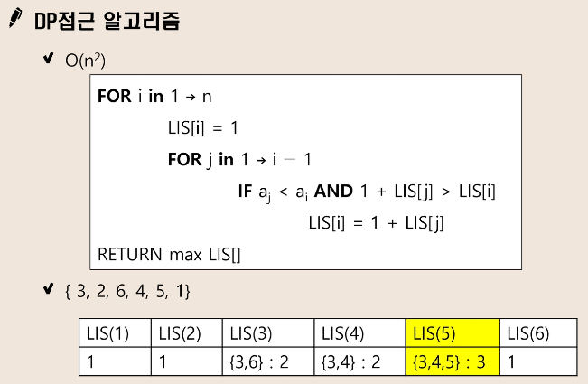

# LIS(Longest Increasing Subsequence : 최장증가수열)

- 어떤 수열이 왼쪽에서 오른쪽으로 나열되어 있으면, 그 배열 순서를 유지하면서 크기가 점진적으로 커지는 가장 긴 부분수열을 구하는 문제

### 1. Brute-force 접근  
수열의 모든 부분 집합을 구하여 그 부분 집합이 증가 수열인지 판별하고 가장 길이가 긴 값을 구함

### 2. DP 접근  
  
