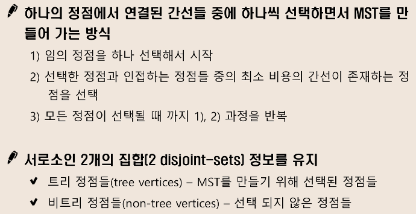

# MST(Minimum Spanning Tree : 최소신장트리)

- 모든 정점을 연결하는 간선들의 가중치의 합이 최소가 되는 트리
- 두 정점 사이의 최소 비용의 경로 찾기


### 1. Prim 알고리즘
  

```java
public class PrimTest2 {
	public static void main(String[] args) throws NumberFormatException, IOException {
		System.setIn(new FileInputStream("prim_input.txt"));
		BufferedReader br = new BufferedReader(new InputStreamReader(System.in));
		int N = Integer.parseInt(br.readLine());
		int[][] adMatrix = new int[N][N]; // 정점 정보들을 인접행렬로 표현
		boolean[] visited = new boolean[N]; // 정점 방문여부
		PriorityQueue<Vertex> list = new PriorityQueue<Vertex>(); // 방문한 정점들을 우선순위큐로 생성

		StringTokenizer st;
		for (int i = 0; i < N; i++) { // i정점부터 j정점까지 비용 저장
			st = new StringTokenizer(br.readLine());
			for (int j = 0; j < N; j++) {
				adMatrix[i][j] = Integer.parseInt(st.nextToken());
			}
		}

		int cnt = 0, result = 0;

		// 1. 임의의 정점(0)을 첫 정점으로 선택
		list.offer(new Vertex(0, 0));

		// 2. 선택한 정점과 인접하는 정점들 중 최소비용의 간선이 존재하는 정점을 선택
		while (!list.isEmpty()) {
			Vertex current = list.poll(); // 최소 비용의 정점이 나옴
			if (visited[current.vertex])// 하지만 이미 처리된 정점이 다시 등장하는 경우가 생길 수 있으므로 이를 처리하는 코드가 필요
				continue;
			visited[current.vertex] = true; // 방문처리하고
			result += current.weight; // 결과값에 더함
			if (++cnt == N) // 모든 정점을 방문했으면 break
				break;

			for (int i = 0; i < N; i++) {
				if (!visited[i] && adMatrix[current.vertex][i] != 0) {
					list.offer(new Vertex(i, adMatrix[current.vertex][i]));
				}
			}

		}

		System.out.println(result);

	}

	static class Vertex implements Comparable<Vertex> {
		int vertex; // 다음 정점까찌의
		int weight; // 가중치

		public Vertex() {
		}

		public Vertex(int vertex, int weight) {
			this.vertex = vertex;
			this.weight = weight;
		}

		@Override
		public int compareTo(Vertex o) { // 오른차순 정렬
			return Integer.compare(this.weight, o.weight);
		}

	}
}
```

### 2. KRUSKAL 알고리즘
  

```java
public class KruskalTest {
	static int V, E, cnt;
	static long totalWeight;
	static int[] parents;
	static Vertex[] vertexs;

	public static void main(String[] args) throws FileNotFoundException {
		System.setIn(new FileInputStream("sample_input.txt"));
		Scanner sc = new Scanner(System.in);
		int T = sc.nextInt();
		for (int test_case = 1; test_case <= T; ++test_case) {
			totalWeight = 0;
			cnt = 0;
			V = sc.nextInt();
			E = sc.nextInt();
			parents = new int[V + 1];
			vertexs = new Vertex[E];

			for (int i = 0; i < E; i++)
				vertexs[i] = new Vertex(sc.nextInt(), sc.nextInt(), sc.nextLong());

			// kruskal 알고리즘 활용
			// 1. 간선의 가중치 오름차순으로 정렬
			Arrays.sort(vertexs, new wComparator());

			// 2. 가중치가 낮은 간선부터 트리 연결 & 확장
			// 3. 사이클 여부 판단을 위한 disjoint_set 구현
			// 4. 정점수-1 개의 간선이 선택될 때까지 반복
			Arrays.fill(parents, -1);
			for (Vertex v : vertexs) {
				if (disjointSet(v.from, v.to)) {
					totalWeight += v.weight;
					cnt++;
				}
				if (cnt == V - 1)
					break;
			}

			System.out.printf("#%d %d\n", test_case, totalWeight);
		}
	}

	public static boolean disjointSet(int a, int b) {
		int aRoot = find(a);
		int bRoot = find(b);
		if (aRoot != bRoot) {
			parents[bRoot] = aRoot;
			return true;
		}
		return false;
	}

	public static int find(int f) {
		if (parents[f] < 0)
			return f;
		return parents[f] = find(parents[f]);
	}

}

class wComparator implements Comparator<Vertex> {
	public int compare(Vertex o1, Vertex o2) {
		return Integer.compare((int) o1.weight, (int) o2.weight);
//		return (int) (o1.weight - o2.weight);
	}
}

class Vertex {
	int from;
	int to;
	long weight;

	public Vertex() {
	}

	public Vertex(int from, int to, long weight) {
		this.from = from;
		this.to = to;
		this.weight = weight;
	}

}
```