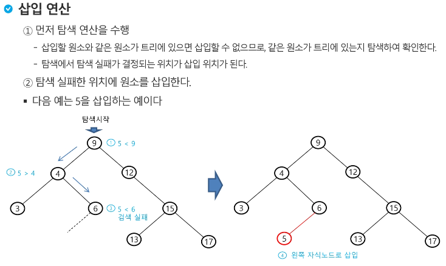

# 탐색(Search) 알고리즘

## 1. 2진 탐색(Binary Search)

정렬되어 있는 1차원 배열에서 특정 수를 찾는 탐색 알고리즘  
1) 배열(arr)의 중앙 위치(mid)와 찾는 값을 비교  
2) 찾는 값이 arr[mid]값보다 작으면 mid보다 왼쪽 만을, 크면 arr[mid]보다 오른쪽 만을 가지고 다시 탐색
3) 1, 2를 반복

## 2. 2진 탐색 트리(Binary Search Tree)

노드의 데이터 값이 왼쪽 자식 노드 < 부모 노드 < 오른쪽 자식 노드 로 저장하여 특정 수를 찾는 탐색 알고리즘  
1) 루트에서 시작  
2) 탐색할 값과 루트값을 비교  
3) 탐색할 값이 루트값보다 작은 경우 왼쪽 자식노드를, 큰 경우 오른쪽 자시노드를 탐색
4) 2, 3을 반복  

**2진 탐색 트리를 위해서는 삽입 위치를 규칙에 맞게 저장하는 알고리즘이 필요하다**  

