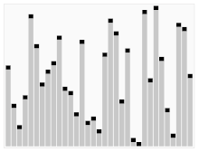

# Sort(정렬)

## 1. Array Sort  

### 1.1. Bubble Sort  
0번째 인덱스부터 하나씩 증가하며 바로 옆에 인접한 두 수를 계속하여 비교하며 정렬.

### 1.2. Counting Sort  
숫자를 카운팅하며 정렬.

### 1.3. Quick Sort  
Pivot을 기준으로 pivot보다 작은 작은 값들과 크거나 같은 값들로 나누며 정렬.  
  
[출처 : 위키백과]

### 1.4. Insertion Sort  
정렬할 자료를 정렬된 앞부분 S집합과 아직 정렬되지 않은 뒷부분 U집합으로 나누고 U에서 원소를 하나씩 꺼내 S의 마지막 원소부터 비교하며 위치를 찾아 삽입하는 정렬.

### 1.5. Merge Sort  
여러개의 정렬된 자료의 집합을 병합하여 한개의 정렬된 집합으로 만드는 방법.

## 2. Graph Sort  

### 2.1. Topologist Sort  
일이 진행되는 순서를 찾는 정렬 알고리즘  

## 3. Sort API

### 3.1. API : Collections.sort

- Comparable의 **CompareTo(T other)**

>자신의 값과 other 값의 뺄셈 결과가  
>① 음수 : 바꾸지 않음 -> 오름차순  
>② 0 : 바꾸지 않음 -> 오름차순  
>③ 양수 : 바꿈 -> 내림차순  

- Comparator의 **Compare(a, b)**

>a와 b 값의 뺄셈 결과가  
>① 음수 : 바꾸지 않음 -> 오름차순  
>② 0 : 바꾸지 않음 -> 오름차순  
>③ 양수 : 바꿈 -> 내림차순  

① 

② 

③ 

④ 
