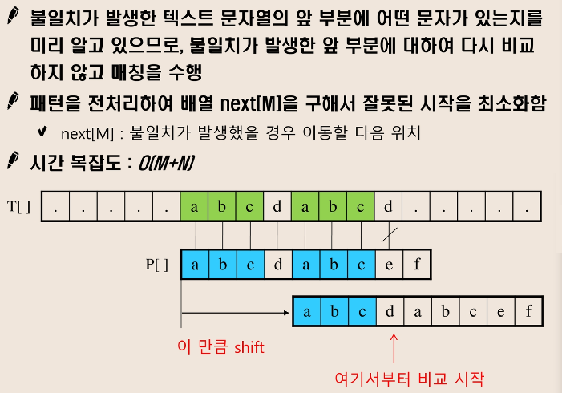

# 문자열 String탐색

## 1. 라빈-카프 알고리즘
  

## 2. KMP 알고리즘
  

```java
public class KMPTest {
	public static void main(String[] args) throws IOException {
		BufferedReader br = new BufferedReader(new InputStreamReader(System.in));
		char[] T = br.readLine().toCharArray();
		char[] P = br.readLine().toCharArray();

		int tLen = T.length;
		int pLen = P.length;
		int[] fail = new int[pLen];

		// 1. 탐색 실패한 경우에 돌아갈 인덱스 베열을 먼저 만들어줌.
		for (int i = 1, j = 0; i < pLen; i++) {
			while (j > 0 && P[i] != P[j])
				j = fail[j - 1];

			if (P[i] == P[j])
				fail[i] = ++j;
		}

		int cnt = 0;
		for (int i = 0, j = 0; i < tLen; i++) {
			while (j > 0 && T[i] != P[j]) {
				j = fail[j - 1];
			}
			if (T[i] == P[j]) {
				if (j == pLen - 1) { // 패턴의 끝까지 다 맞는 경우
					cnt++;
					j = fail[j];
				} else {
					++j;
				}
			}
		}

		System.out.println(cnt);
	}
}
```

## 3. 보이어-무어 알고리즘
  


