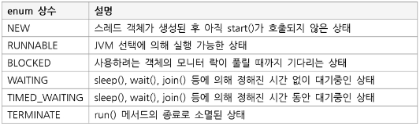

## 멀티스레드(Multi Thread)

### 1. 멀티 스레드 프로그래밍  
**1. Application과 Proccess**  
- Application : 하드웨어에 있는 프로그램  
- Proccess : 메모리에 적재되어 개별적으로 동작하는 프로그램  

**2. Thread와 Proccess**  
- Thread : 프로세스를 구성하는 작은 실행 단위  
- Multi Thread : 여러 스레드가 동시에 동작  
- Multi Proccess : 여러개의 프로세스를 동시에 동작  

**3. Multi Thread를 사용하는 이유**  
- 성능이 우수한 CPU의 활용도를 높일 수 있다.  
- 작업의 분리로 응답성이 향상된다.  
- 자원 공유를 통해 효율성이 증대된다.  

### 2. Thread 생성  
**1. Runnable 인터페이스를 상속받는 방법**  
일반적인 자바 프로세스의 출발점은 main()이지만 Thread의 출발점은 run()메서드 이다.

```
구현
1) Runnable 인터페이스를 상속받아 Run 메서드를 오버라이딩 한다.
2) Runnable 객체를 Thread의 생성자에 파라미터로 넘겨 Thread 객체를 생성한다.
```

**2. Thread 클레스를 상속받는 방법**  
Thread 클래스는 Runnable을 구현하고 있다. 따라서 별도로 Runnable 객체를 파라미터로 넣을 필요 없이 Thread를 생성할 수 있다.
하지만 단일 상속 제약으로 다른 클래스를 상속받을 수 없는 단점이 있다.

```
구현
1) Thread 클래스의 run() 메서드를 오버라이딩 한다.
```

### 3. Thread 실행  
Thread의 실행은 실행점에서 start() 메서드를 호출하여 실행시킨다.  
run() 메서드로 직접 호출 시 호출된 지점에서 돌려주기 때문에 동기식으로 동작하게 된다.  
즉, 차례로 동기식 수행을 하게 되므로 원하는 Thread 동작을 수행하지 못한다.  

### 4. Thread 상태와 제어  
**1. Thread 상태**  
  

### 5. Thread 동기화  
**1. Synchronized**  
synchronized는 메서드 등 블록에 사용하며 해당 영역은 동시에 하나의 스레드만 사용할 수 있도록 한다.  
모든 자바 객체는 lock을 가지고 있는데 thread t1이 lock을 가지고 있다면 thread t2는 t1이 lock을 반납할 때까지 기다렸다가 t1이 반납하면 가져간다.

