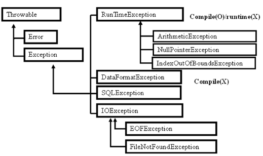

## Exception(예외)
java에서 오류는 객체이고 크게 2가지로 분류된다.

1. Exception : 프로그램 실행 도중 기대되지 않는 상황 발생, sw적 오류

 1) RuntimeException

 - ArrayIndexOutOfBoundException : 배열의 접근 범위를 벗어난 경우
 - NegativeArraySizeException : 배열의 size를 음수로 생성한 경우
 - . . .

 2) Exception
 - FileNotFoundException : 지정한 경로에 파일이 없는 경우

2. Error : 치명적인 오류 발생, system적 오류
 - OutOfMemoryError : heap 메모리 부족, GC를 돌려도 공간이 부족해 객체를 생성할 수 없음
 - StackOverFlowError : stack 메모리 부족, 잘못된 recursive call로 stack에 공간이 부족해 더이상 호출할 수 없음
 - NoSuchMethodError : main이 없음
 
