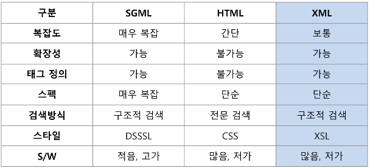
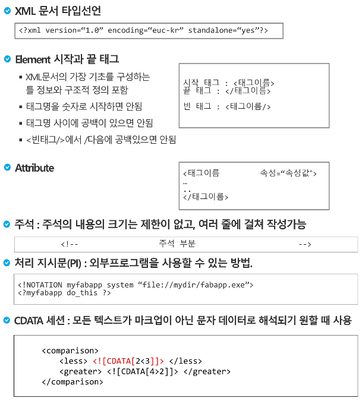

## XML(Extensible Markup Language)  
고정된 태그 형식이 아닌 삿용자가 직접 태그를 정의할 수 있는 확장형 markup language로 Text 형식을 지원하는 언어이다.  

### 1. HTML(HyperText Markup Language)  
- W3C(World Wird Web Consortium)에서 정의한 웹 표준 언어  
- 하이퍼텍스트, 하이퍼미디어 기능 지원  
- 쉽고 간결한 문법
- 많은 벤더와 사용자 지원
- 단점 : 한정된 태그, 태그 의미 전달 못함, 문서의 계층 구조 표현 못함, 정보의 재사용이 어려움  
- 각 언어별 기능  

### 2. XML의 장점  
- XML은 서식이 아닌 구조와 의미를 설명  
- 특정 분야별 마크업 언어 설계 가능  
- 스스로 설명 가능한 데이터  
- 다른 어플리케이션 간 데이터 교환 가능
- 구조화되고 통합된 데이터  
- 구조 검색 및 전문 검색 가능  

### 3. XML 문서  

**1. Well-Formed Document**  
- 구문이 일반적인 규칙을 따른다.  
- HTML과 달리 구문 체크가 까다롭다.  
- Case Sensitive  
- Closing Tags  
- No Overlapping Tags  
- Root Element  
- Attribute : name='value' 또는 name="value"  

**2. Valid Document**  
- XML문서가 DTD(Document Type Definition)나 Schema에 맡게 되어 있는지를 검사.  
- Parser는 XML 문서에 대해 먼저 적정형식을 따르고 있는지 검사하고, 다음으로 DTD의 구조에 대한 규정을 따르고 있는지를 검사.  
- Valid 문서는 Well-formed 문서이면서 DTD다 Schema에 정의된 형식에 맞는 문서를 뜻 함.  

### 4. XML 문서 구성

### 5. namespace  
- xmlms:prefix="구조 URL"  
- 태그 <prefix:태그명></prefix:태그명>    

### 6. XML API  

**1. SAX**  
속도가 빠르나 search만 가능함.  

**2. DOM**  
속도가 느리나 추가, 수정, 삭제가 가능함.  

