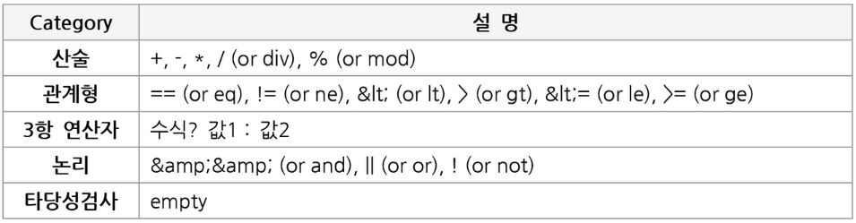
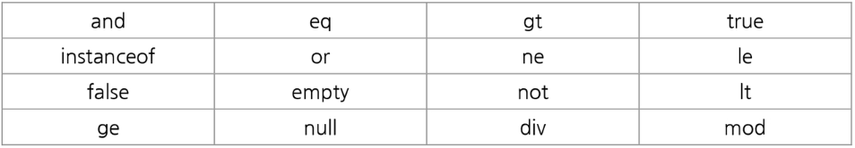

# JSP

## 10. Custom Tag와 JSTL & EL  

### 10.1. Custom Tag  

### 10.2. JSTL  

### 10.3. EL(Expression Language)  
JSP 스크립트를 대신하여 속성 값을 쉽게 출력하도록 고안된 Language  
1. HTML 출력 위치 : 출력역할  
2. JSTL 태그 내 속성값 위치   : 표현식 처리 결과 전달 역할

```html
${ 속성명 }
```

**10.3.1. EL 접근자와 연산자**  

1) 접근자(Accessor)  

```html
${내장객체.속성명}
${내장객체['속성명']}
```

2) 연산자(Operator)  
  

```html
예시
${item.price * (1 + taxRate[user.address.zipcode])}
${(x >= min) &amp;&amp; (x <= max)}
```

3) null  
EL은 null데이터를 출력하지 않는다. 또한 null 값을 계산하여도 error가 발생하지 않도록 처리한다.  

4) 예약어  
  


