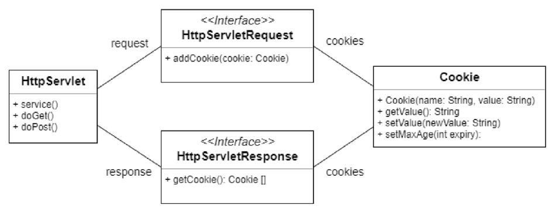

# Servlet  

## 10. Cookie  
클라이언트 단위로 상태정보를 유지해야 하는 경우 쿠키와 세션을 사용.  
쿠키는 클라이언트 측에 텍스트 타입으로 데이터가 저장되며 세션은 서버 측에 객체 타입으로 데이터가 저장됨.
쿠키로 저장할 수 있는 데이터 크기는 제한되어 있지만 세션은 서버가 수용할 수 있는 만큼 데이터 저장 가능.

### 10.1. Cookie란  
웹 서버에서 적은 양의 정보를 웹 브라우저에게 보내고, 웹 브라우저는 그 정보를 저장하고 있다가 나중에 다시 이 웹페이지를 방문할 때 웹서버에게 제출하도록 한다.  
1. 클라이언트 요청에 따라 웹 서버는 클라이언트에게 응답을 통해 쿠키 부여  
2. 쿠키가 사용자의 디스크나 웹 브라우저 메모리에 저장됨  
3. 사용자가 쿠키를 부여 받은 웹 사이트를 다시 요청할 때 쿠키가 전송  
4. 웹 서버는 해당 쿠키를 통해 클라이언트 구별  

### 10.2. Cookie 클래스  
  

### 10.3. Cookie 생성 및 추출  

``` java
protected void doPost(HttpServletRequest request, HttpServletResponse response) throws ServletException, IOException {
	// 쿠키 생성
	Cookie cookie = new Cookie("name", URLEncoder.encode("쿠키 테스트"));
	
	// 쿠키 유효시간 설정(음수:메모리에만 저장->브라우저 종료시 쿠키 삭제, 0:쿠키 삭제, 양수:지정시간동안 메모리에 저장)
	// 365일에 대하 쿠키 유효시간 설정(초단위)
	cookie.setMaxAge(365 * 24 * 3600);
	
	// 쿠키 추가
	response.addCookie(cookie);
	
	// 쿠키 추출(배열 단위로 받아옴)
	Cookie[] cookies = request.getCookies();
	for{
		out.println(cookies[i].getName());
		out.println(URLDecoder.decode(cookies[i].getValue()));
	}
}
```

## 11. Session  
1. 클라이언트가 특정 도메인에 요청  
2. 서버는 접속한 클라이언트에 대한 session id를 생성하고 그 값을 저장  
3. 서버는 session id와 함께 클라이언트에게 응답  
4. 클라이언트는 session id를 쿠키로 저장(이때 쿠키늬 이름은 'jsessionid'이다.)  
5. 클라이언트가 도메인에 재요청시 저장된 session id를 서버에 넘김  
6. 서버는 클라이언트에서 받은 session id를 이용하여 클라이언트를 구별  

### 11.1. Session 생성  

``` java

protected void doPost(HttpServletRequest request, HttpServletResponse response) throws ServletException, IOException {
	// 세션이 잇으면 리턴하고 없으면 새로 생성하여 리턴
	// false : 설정 시 세션이 없으면 null리턴 
	HttpSession session = getSession();
	
	// 세션 타임아웃 시간 설정
	session.setMaxInactiveInterval(초단위);
	
	// 세션 적용(?)
	if(session.isNew()){
		session.setAttribute("userID", "user");
	}else {
		session.getAttribute("userID");
	}
}
```
