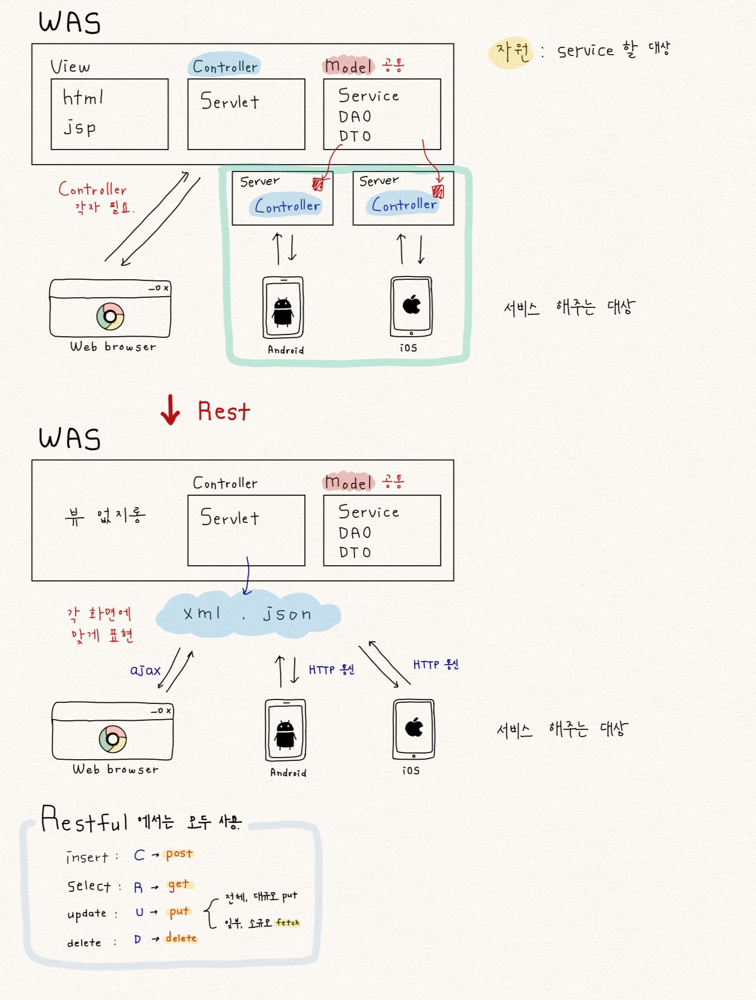

# Spring Framework

## 1. Spring  

### 1.1. Spring Container  
- 정의 : 빈 객체를 저장하고 있으며 각 객체간의 의존관계를 관리  
- 특징 : 컨테이너에 객체를 담아두고, 필요할 때에 컴테이너로부터 객체를 가져와 사용  
- 주요 인터페이서 : BeanFactoty < ApplicationContext < WebApplicationContext  

### 1.2. BeanFactory 인터페이스  
- 정의 : 빈 객체를 관리하고 각 빈 객체간의 의존관계를 설정해주는 기능을 제공  
- XmlBeanFactory 클래스  
	- BeanFactory 인터페이스 구현 클래스  
	- 외부 자원으로부터 설정 정보를 읽어와 빈 객체를 생성  
	- Resource를 이용하여 XmlBeanFactory에 설정 정보를 전달  

### 1.3. ApplicationContext 인터페이스  
- 정의 : BeanFactory가 제공하는 빈 관리 기능 이외에 파일과 같은 자원 처리, 추상화, 메시지 지원 및 국제화 지원, 이벤트 지원 등의 기능을 제공  

### 1.3. WebApplicationContext 인터페이스  
- 웹 어플리케이션을 위한 ApplicationContext  
- 웹 어플리케이션을 취해 추가적으로 제공되는 빈 영역을 정의  
- 하나의 웹 어플리케이션마다 한 개의 WebApplicationContext가 존재  
- XmlWebApplicationContext 클리스  
	- 웹 으폴리케이션에 위치한 XML 파일로부터 설정 정보를 로딩  

### Factory Pattern  

```java
public class ArticleFactory{
	public static ArticleDao getInstance(){
		return new MysqlArticleDao();
	}
}

public class XXXServiceImp{
	ArticleDao dao = ArticleFactory.getInstance();
}
```

### DI(Dependency Injection)  
의존하는 객체(속성)를 직접 생성하지 않고 생성자나 setter 메서드를 통해 받음.  
의존 : 클래스 내에 있는 함수나 속성이 아닌 다른 클래스의 함수나 속성을 사용  
-> 상속, 속성, 인자로 다른 클래스를 사용  


## 2. AOP (Aspect Oriented Program)  

### 2.1. execution 명시자    
Advice를 적용할 메서드 지정

```java  
execution([수식어] [리턴타입] [클래스이름] [이름]([파라미터])
```

**기본 형식**  
- "*" 는 모든 값을 의미  
- ".." 는 0개 이상 의미  

**수식어**  
- 생략가능  
- public, protected 등등  

**리턴타입**  
- 메서드의 리턴타입 지정  

**클래스이름, 이름**  
- 클래스의 이름 및 메서드의 이름 지정  

**파라미터**
- 메서드 파라미터 지정  


**ex1**  

```java
execution(* some.package.*.*())
```

- some.package 패키지 내  
- 파라미터가 없는 모든 메서드 호출  


**ex2**

```java
execution(* some.package..*.*(..))
```

- some.package 패키지와 하위 패키지에 있는  
- 파라미터가 0개 이상인 모든 메서드 호출  


**ex3**

```java
execution(String some.package.SomeService.someMethod(..))
```

- 리턴 타입이 String,  
- some.package.SomeService 인터페이스 내  
- 파라미터가 0개 이상인 someMethod 메서드 호출  


**ex4**

```java
execution(* some*(*))
```

- 메서드 이름이 some으로 시작되고,  
- 파라미터가 1개인 메서드 호출  


**ex5**

```java
execution(* some*(*, *))
```

- 메서드 이름이 some으로 시작되고,  
- 파라미터가 2개인 메서드 호출  


**ex6**

```java
execution(* some*(String, ..))
```

- 메서드 이름이 some으로 시작되고,  
- 첫번째 파라미터 타입이 String,  
- 파라미터가 1개 이상인 메서드 호출  

### 2.2. Advisor  
공통코드/공통모듈(Aspect)를 수행할 시점

||첫번째 인자|두번째 인자|리턴값|
|---|--------|--------|----|
|Before|Join Point|X|X|
|After|Join Point|X|X|
|AfterReturning|Join Point|Object|X|
|AgterThrowing|Join Point|Throwable|X|
|Around|Proceeding Join Point|X|Object|


## 3. REST(REpresentation State Transfer)

### 3.1. RestFul  
  

### 3.2. Swagger  

## 기타  

### Srping Project 작성 순서  
1. web.xml 설정  
	- contextConfigLocation 경로 설정 및 파악  
	- encoding Filter 설정  
2. contextConfigLocation 설정  
	- mvc-config.xml  
		- controller scan  
		- resolver  
	- application-config.xml  
		- dao  
		- service scan  
		- Database  
		- myBatis  
3. myBatis 환경 설정  
	- Alias 설정  
	- query xml 경로 설정  
4. query xml 작성  
5. dao, service, controller 작성  
6. view 작성  
