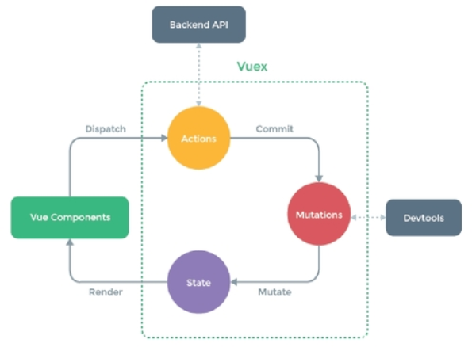

# Vue

## 1. Vue  
Front-End에 적용할 수 있는 프레임워크.  
jQuery 등이 작업했던 화면의 데이터나 동적 처리 기능(함수) 등을 컴포넌트화 하여 제공.  
※ <b>Component</b> : UI를 구성하는 각각의 부품의 개념. UI상에 같은 부분을 재사용하고 싶은 경우 component화 하여 재사용 할 수 있다.  

### 1.1. Vue 폴더 구조  
>[Project]  
>> [node_modules] 외부 모듈  
>>> xxx.js  

>> [public] 싱글 페이지  
>>> index.html  

>> [src]  
>>> [component] 각각의 컴포넌트 파일  
>>>> xxx.vue  

>>> App.vue  
>>> Main.js  

## 2. Vue 컴포넌트 간 데이터통신

### 2.1. Event Bus  
모든 component들이 공유해서 사용
- on() : 수신할 이벤트 버스 연결 => $on.('이벤트 명', callback 할 함수)  
- emit() :   송신할 이벤트 버스 연결 => $emit.('이벤트 명')  

### 2.2. parent - child 통신  
Parent component와 Child component가 event를 주고 받음.
- Parent -> Child : props()로 데이터 전달  
- Child -> Parent : emit()로 이벤트를 발생시켜 전달. 자기 자신에게 emit하면 부모에게 이벤트를 보낸다는 의미.  
ex) this.$emit('이벤트명', [송신할 데이터])

### 2.3. VueX  
VueX는 store라는 저장소 개념을 사용하는 상태 저장 컨테이너.  
- VueX store는 반응형으로 Vue 컴포넌트의 상태를 검색할 때 저장소의 상태가 변경되면 자동으로 변경  
- 저장소의 상태를 직접 변경할 수 없고, 명시적인 커밋을 통해 상태를 변경(mutation)  
- 데이터 상태 변화 history가 log로 남아 모니터링이 가능  

#### 2.3.1. VueX 구조  
  
- Actions : 시간이 많이 소요되고 비동기 작업의 메서드들 구현, commit을 통해 Mutations 호출  
- Mutations : 시간이 많이 소요되지 않고 동기적 작업의 메서드들 구현, mytate를 통해  State 호출  
- State : Mutations로 하여금 state.status가 인증되어 상태를 변경  

## 3. Vue Router  
컴포넌트(각각의 vue)를 navigation 가능하게 만들어줌.  
즉, 페이지를 전환하는 개념.  

### 3.1. 링크를 통한 컴포넌트 전환(정적이 강함)  
router-link 태그 사용  

### 3.2. 코드를 통한 컴포넌트 전환(도적이 강함)  
router의 push() 메서드 사용  
